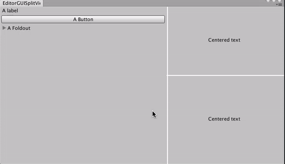

#EditorGUISplitView

_EditorGUISplitView_ is an utility view that allows you to easily add a split view with draggable resize functionality to your Editor Windows.




It couldn't be easier to use

```c#

EditorGUISplitView horizontalSplitView = new EditorGUISplitView (EditorGUISplitView.Direction.Horizontal);
	EditorGUISplitView verticalSplitView = new EditorGUISplitView (EditorGUISplitView.Direction.Vertical);

public void OnGUI ()
{
	horizontalSplitView.BeginSplitView ();
	DrawView1 ();
	horizontalSplitView.Split ();
	verticalSplitView.BeginSplitView ();
	DrawView2 ();
	verticalSplitView.Split ();
	DrawView2 ();
	verticalSplitView.EndSplitView ();
	horizontalSplitView.EndSplitView ();
	Repaint();
}

```
